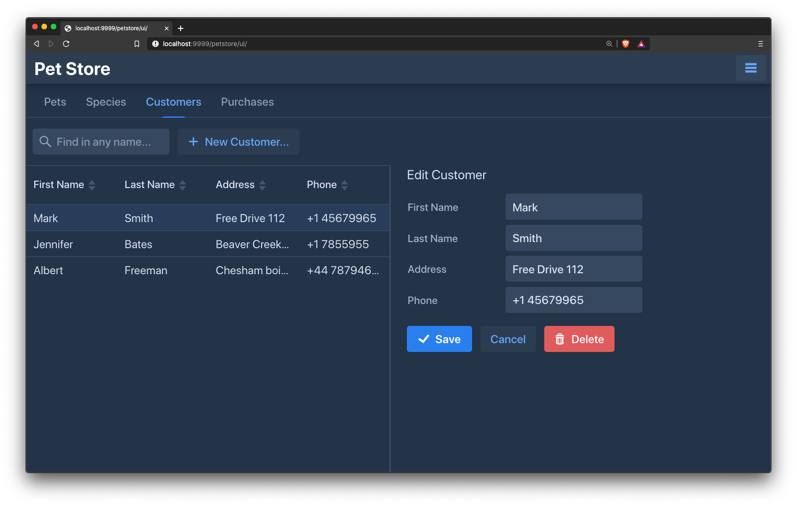

# Vaadin Pet Store

A Vaadin proof of concept showing a pet store application.
The application makes use of Vaadin 16+, Spring Boot 2.3+, 
JPA and Liquibase.



## Running
```
mvn spring-boot:run -Dspring-boot.run.jvmArguments="-Dserver.port=9999"
```
Open http://localhost:9999/

## Generate liquibase schema snapshot from DB
A file from the current DB data can be generated in order to pre-populate the DB with other than the provided default data in (src/main/resources/db/changelog/). 
```
mvn liquibase:generateChangeLog
```

## Related articles

- [Introduction to Vaadin](https://www.baeldung.com/vaadin)
- [Sample Application with Spring Boot and Vaadin](https://www.baeldung.com/spring-boot-vaadin)
