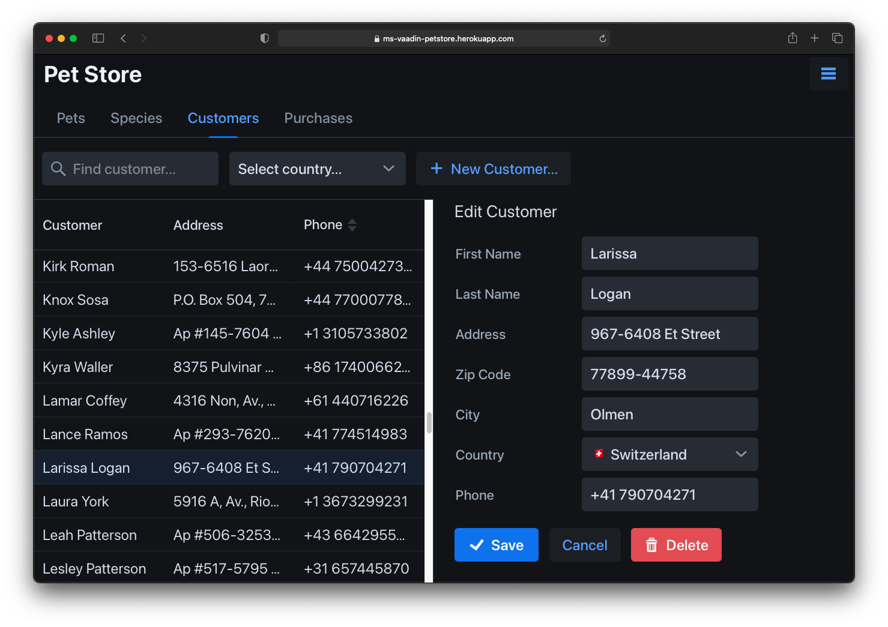
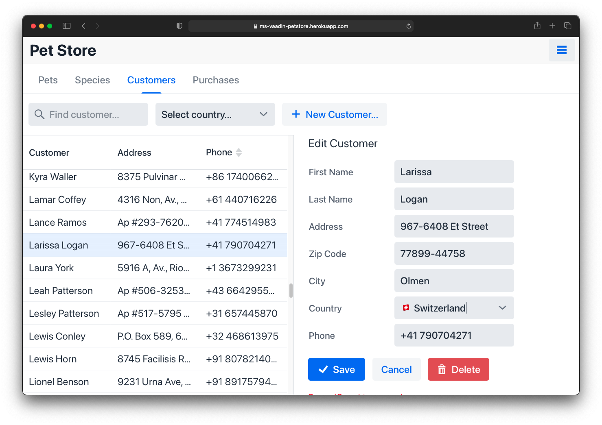

# Vaadin Pet Store

A minimalistic pet store management application implemented in [Vaadin](https://vaadin.com/).  
The application demonstrates the following aspects: 
- Vaadin 19+, Spring Boot 2.4+, JPA and Liquibase 
- All [CRUD](https://en.wikipedia.org/wiki/Create,_read,_update_and_delete) operations.
- UX customizations via CSS and theme switching. 
- Collaborative data editing with real-time updates of data changes in all connected clients.




## Demo
Try out this application at:  
[ms-vaadin-petstore @ heroku](https://ms-vaadin-petstore.herokuapp.com/)

## Running
```
./gradlew bootRun
```
If successful, vaadin-petstore can be accessed under: http://localhost:9999/ in a web browser . 

## Deployment 

In order to deploy the application productively, the production JAR file can be built by running:
```
./gradlew clean build
```

The JAR file can be run:
```
java -jar  $(find build/libs/*.jar|grep -v plain)
```
or renamed to *.WAR and deployed in any servlet-capable server such as:  
[Tomcat](http://tomcat.apache.org/), [Jetty](https://www.eclipse.org/jetty/)

## Advanced

### Run with Docker
Build image:
```
./gradlew bootBuildImage
```

Run:
```
docker run -it -p9999:9999 petstore:1.0.0-SNAPSHOT
```

### Run in Heroku
A free account can be created at [Heroku](https://heroku.com/).  
Once registered, the JAR file from above can directly be deployed by creating a new app with a unique name.  
Provided [Heroku CLI](https://devcenter.heroku.com/articles/heroku-command-line) is installed, the following commands must be run in order to deploy the JAR file:
```
heroku login
heroku plugins:install java
heroku create --no-remote unique-vaadin-petstore-application
heroku deploy:jar $(find build/libs/*.jar|grep -v plain) --app unique-vaadin-petstore-application
# heroku ps:scale web=1 -a unique-vaadin-petstore-application
```

### Generate liquibase schema snapshot from DB
A file from the current DB data can be generated in order to pre-populate a new DB with other than the provided default data in [changelog/](src/main/resources/db/changelog/). 
```
# update (sync) db to current changelog state
gradle update -PrunList=update

# create a changelog against application entities 
gradle diffChangeLog

# change the author in the generated changelog
sed -i "s/author: .*generated.*/author: petstore/" \
    src/main/resources/db/changelog/schema/2*
```

#### H2 shell
```
gradle -q --console=plain h2shell
```

#### Country data
##### Source
https://github.com/dr5hn/countries-states-cities-database
##### Convert countries.json to countries.tsv
```
(
f=".id, .name, .iso2, .iso3, .emoji, .emojiU"
echo "$f"|tr -d ". "|tr , "\t"
jq -c --raw-output '.[] |['"$f"']|@tsv' ./countries.json
) | sed -e "s/^/-/" |\
    tee 103-countries.tsv | head -10
```

## Customization

### Theme colors
https://demo.vaadin.com/lumo-editor/  
--> add the css to frontend/style

## Links

- [Introduction to Vaadin](https://www.baeldung.com/vaadin)
- [Vaadin Components](https://vaadin.com/components)
- [Sample Application with Spring Boot and Vaadin](https://www.baeldung.com/spring-boot-vaadin)
- [Vaadin: Theme Variants](https://vaadin.com/docs/v14/flow/styling/theme-variants)
- [Vaadin: Lumo Customization](https://vaadin.com/docs/v14/flow/styling/lumo/customization)
- [Vaadin: Starting a Project: gradle](https://vaadin.com/docs/latest/guide/start/gradle)
- [Using the Heroku Java CLI Plugin](https://devcenter.heroku.com/articles/deploying-executable-jar-files#using-the-heroku-java-cli-plugin)
- [Liquibase Gradle Plugin](https://github.com/liquibase/liquibase-gradle-plugin)
